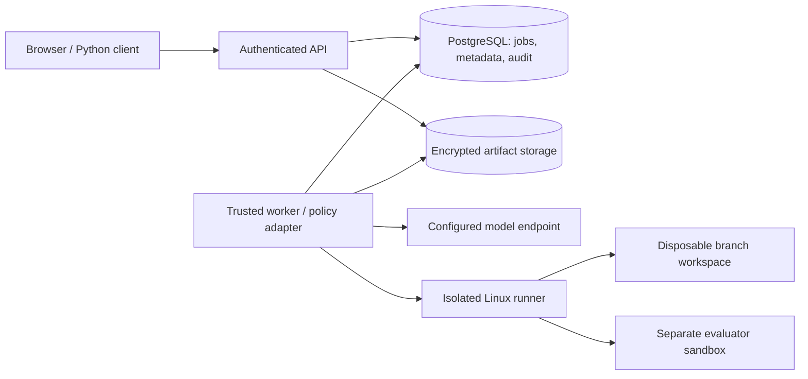

# Architecture

The deployment serves one organization. Its database and artifact bucket are
Agent Rewind's own resources; the service needs no access to application
production databases.

The API never executes submitted code. A trusted worker claims a PostgreSQL job
with `FOR UPDATE SKIP LOCKED` and an owner lease. Every persisted event, budget
reservation, and terminal result checks the owner and unexpired lease. A lost
worker's job becomes failed rather than automatically repeating ambiguous paid
calls. Operators can submit another job after inspecting partial results.

SQLite and encrypted local files support single-worker development. PostgreSQL
and a shared artifact bucket support multiple worker processes. Different
workers can execute different jobs; a single study currently executes its pairs
sequentially to simplify budget and outcome accounting.

## Checkpoint contract

Before a decision, the engine records:

- A file tree with SHA-256 references to encrypted file contents, modes, modified
  times, and empty directories. Identical files share one object.
- JSON policy state, including the accumulated conversation for the chat adapter.
- The next decision index, policy identity, requested trial seed, and resolved
  container image identity.
- Whether capture redaction has made restoration incomplete.

A checkpoint contains no process memory, open sockets, shell state, or external
service state. Each shell invocation starts with the same base image and a
restored `/workspace`. Dependencies must be built into the allowlisted image.
Paths outside the workspace are read-only except a disposable `/tmp`.

The shell runs in a new container. Its workspace is a size-bounded tmpfs volume.
After the command exits, the runner freezes remaining processes, reads the file
archive through the trusted Docker daemon, validates every entry, and destroys
the container and volume. No archive is extracted onto the worker filesystem.
Symlinks, hard links, special files, excessive entries, and oversized snapshots
are rejected. Rejected or redacted runs cannot be branched.

This is an application-level checkpoint, not a transparent operating-system
snapshot. Tasks depending on process continuity, inode identity, ctime, external
entropy, or unmanaged services do not satisfy this contract.

## Event contract

Each event records the proposed action, executed action, actual result, observed
result, pre-decision checkpoint, post-tool workspace, model response metadata,
changed paths, and prior event hash. The event hash covers the complete record.
The database stores immutable references through insert-only application paths.
Reads verify the hash chain and, for completed runs, its head.

Branches reference the parent's prefix instead of rewriting or copying events.
Depth is bounded at 64 ancestors. The parent is unchanged.

### Action replacement

Restore the state before the selected action, execute the replacement, observe
its real result, then request fresh decisions. The original selected decision is
reused in the unchanged control; it is not resampled before the intervention.

### Observation replacement

Restore the original tool's **post-execution workspace**, retain its actual
result for audit, and replace only the result visible to the policy. The original
tool is not executed twice. This prevents a tool-result edit from silently
changing its side effects.

## Failure handling

- Tool nonzero exits are observations. The policy can respond to them.
- Timeouts, excessive output, failed snapshots, and malformed model actions stop
  the run. They are infrastructure or protocol failures, not passing evaluations.
- Cancellation is checked during commands, between decisions, and before writes.
  An in-flight provider call can finish and be billed; no additional call starts.
- Budget reservations occur transactionally before dispatch. Ambiguous calls keep
  their reservation, and no automatic provider retry occurs.
- Worker failure leaves encrypted evidence and partial runs. Orphaned sandboxes
  are reaped only after a conservative lifetime threshold.

A run's `success` means its configured evaluator exited zero in a fresh sandbox.
It is separate from job success: a completed recording can correctly record a
failed agent.
